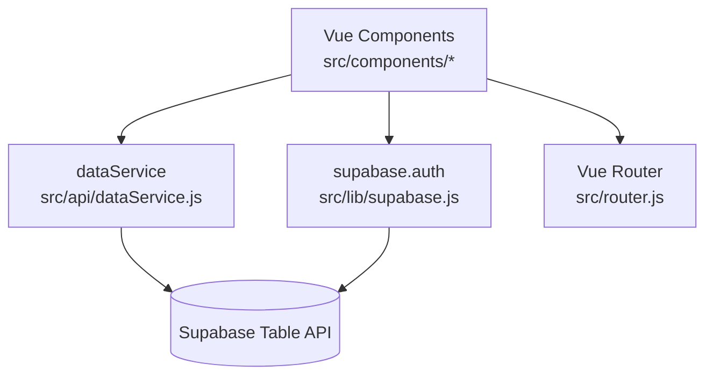

# 01｜整体架构

## 项目定位

驼账宝（camel-profit）是面向养驼场景的记账/经营数据看板应用，核心目标是把“交奶收入 + 每日固定成本 + 杂费 + 饲料进货/库存”整合到一个极简的移动端体验中。

## 技术栈概览

- 前端框架：Vue 3（SFC + `<script setup>`）
- 构建工具：Vite（本项目锁定为 `rolldown-vite` 变体，见 [package.json](file:///workspace/package.json#L6-L33)）
- UI：Element Plus + utility class（Tailwind CSS 在依赖中，但本仓库未见 `tailwind.config.*`）
- 路由：Vue Router（见 [router.js](file:///workspace/src/router.js)）
- 数据与鉴权：Supabase（见 [supabase.js](file:///workspace/src/lib/supabase.js) 与 [dataService.js](file:///workspace/src/api/dataService.js)）
- 多端：Capacitor（`android/`、`ios/` + [capacitor.config.json](file:///workspace/capacitor.config.json)）
- Web 部署：Vercel rewrite（见 [vercel.json](file:///workspace/vercel.json)）

## 架构分层（从上到下）

说明：

- UI 层以页面组件为中心组织：Dashboard / HistoryView，其他为弹窗与引导组件。
- 数据访问层集中在 `dataService`，对不同表进行封装，减少组件内散落的 CRUD。
- Supabase Client 统一在 `src/lib/supabase.js` 创建，运行时根据环境切换直连/代理 URL。

## 多运行环境（Web Dev / Web Prod / App）

### 1) Web 开发环境（本地）

- 通过 Vite dev server 启动（`npm run dev`）。
- `supabaseUrl` 直接使用 `VITE_SUPABASE_URL`（见 [supabase.js](file:///workspace/src/lib/supabase.js#L10-L13)）。

### 2) Web 生产环境（Vercel）

- `import.meta.env.PROD` 且 `!isApp` 时，Supabase URL 切到 `window.location.origin + '/api/supabase'`（见 [supabase.js](file:///workspace/src/lib/supabase.js#L10-L13)）。
- 由 Vercel rewrite 把 `/api/supabase/*` 转发到真实 Supabase 项目域名（见 [vercel.json](file:///workspace/vercel.json#L1-L7)）。

### 3) 移动端 App（Capacitor 壳）

- Capacitor 以 `webDir=dist` 加载打包产物（见 [capacitor.config.json](file:///workspace/capacitor.config.json#L1-L5)）。
- `isApp` 的判断为 `origin` 包含 `localhost` 或 `capacitor`（见 [supabase.js](file:///workspace/src/lib/supabase.js#L8-L12)），此时仍直连 `VITE_SUPABASE_URL`。

## 目录结构速览

- `src/`
  - `main.js`：应用启动、Element Plus、Router 注册（见 [main.js](file:///workspace/src/main.js)）
  - `App.vue`：登录态分流 + 顶层布局与底部导航（见 [App.vue](file:///workspace/src/App.vue)）
  - `router.js`：路由定义（见 [router.js](file:///workspace/src/router.js)）
  - `lib/supabase.js`：Supabase client 初始化与环境切换（见 [supabase.js](file:///workspace/src/lib/supabase.js)）
  - `api/dataService.js`：表 CRUD 与组合查询（见 [dataService.js](file:///workspace/src/api/dataService.js)）
  - `components/`：页面与弹窗组件（Dashboard、HistoryView 等）
  - `utils/format.js`：金额/日期格式化（见 [format.js](file:///workspace/src/utils/format.js)）
- `android/`：Capacitor Android 工程（入口类见 [MainActivity.java](file:///workspace/android/app/src/main/java/com/camelprofit/app/MainActivity.java)）
- `ios/`：Capacitor iOS 工程（入口见 [AppDelegate.swift](file:///workspace/ios/App/App/AppDelegate.swift)）

