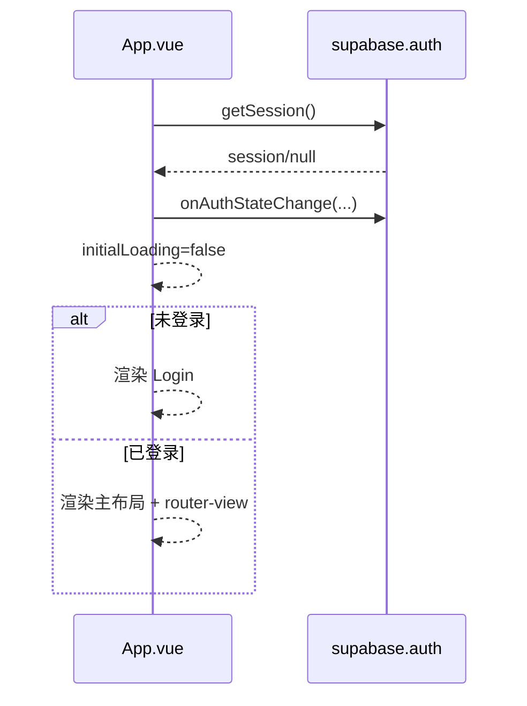

# 04｜关键流程

## 1) 应用启动与登录态分流

入口：[App.vue](file:///workspace/src/App.vue)



要点：

- `initialLoading` 解决“刷新后短暂闪现登录页/白屏”的体验问题。
- 登录态变更（登录/登出）通过 `onAuthStateChange` 实时驱动 UI。

## 2) 手机号 + 密码登录/注册

入口：[Login.vue](file:///workspace/src/components/Login.vue)

### 背景

Supabase 邮箱登录要求 email 格式，本项目把手机号拼成虚拟邮箱 `手机号@camel.local`（用户不可见）。

### 流程

```mermaid
flowchart TD
  A[用户输入 phone/password] --> B{校验手机号/密码}
  B -- 不通过 --> X[提示 warning]
  B -- 通过 --> C[signInWithPassword(email=phone@camel.local)]
  C -- 成功 --> OK[登录成功]
  C -- Invalid login credentials --> D[signUp(email,password, phone_number metadata)]
  D -- 成功 --> E[再次 signInWithPassword]
  E -- 成功 --> OK
  D -- 失败 --> ERR[提示 error]
  C -- 其他错误 --> ERR
```

## 3) 首次初始化（SetupWizard）

入口：[SetupWizard.check](file:///workspace/src/components/SetupWizard.vue#L148-L168)

触发条件：

- settings 表不存在，或 `daily_template` 为空

保存动作：[saveSettings](file:///workspace/src/components/SetupWizard.vue#L173-L197)

- upsert settings（规模/奶价/频率/模板）
- 插入当日 `cost`（把 daily_template 落账为 `日常支出`）
- 若用户填写了 `milk_quantity_per_time`，插入当日 `income`（`驼奶销售` + `duration=milk_frequency`）
- 设置 `localStorage.is_new_user = true`，Dashboard 在首次同步后会自动弹出 UI 指引（见 [Dashboard.vue](file:///workspace/src/components/Dashboard.vue#L258-L262)）

## 4) 首页数据同步与“自动补齐日常支出”

入口：[Dashboard.syncData](file:///workspace/src/components/Dashboard.vue#L240-L262)

同步内容：

- `income`：限制 200 条（按 date desc）
- `cost`：限制 500 条（按 date desc）
- `settings`：单条（maybeSingle）

自动补齐日常支出：

- 实现：[autoFillMissingCosts](file:///workspace/src/components/Dashboard.vue#L228-L238)
- 策略：
  - 找到最后一条 `cost_type='日常支出'` 的日期
  - 从下一天开始，直到今天，把 settings.daily_template 每一项都插入一条 cost

价值：

- 保证利润/库存等计算是“连续日”口径；避免用户只在少数日期录入导致看板波动过大。

## 5) 记账主入口（AddRecordModal 多场景）

入口：[AddRecordModal.openWithScene](file:///workspace/src/components/AddRecordModal.vue#L179-L201)

### 场景 A：卖奶

- 默认 `category='驼奶销售'`
- 会读取：
  - 最近一条卖奶记录的 `unit_price, duration`（用于记住上次填写）
  - settings 的 `milk_price, milk_frequency`（作为回退默认）
- 提交时会校验：同一天是否已存在 `category='驼奶销售'`（见 [AddRecordModal.vue](file:///workspace/src/components/AddRecordModal.vue#L212-L216)）

### 场景 B：买饲料（库存进货）

- 插入 cost：`cost_type='库存进货'` + `weight`（吨）
- 若 `weight > 0` 则调用 `incrementInventory` 将库存累加（见 [AddRecordModal.vue](file:///workspace/src/components/AddRecordModal.vue#L218-L221)）
- 额外行为：如果 daily_template 中不存在该饲料名，会自动补进模板（quantity/unit_price 默认 0），方便未来做库存天数估算（见 [AddRecordModal.vue](file:///workspace/src/components/AddRecordModal.vue#L222-L229)）

### 场景 C：录入库存（盘点）

- 支持两种输入模式：
  - `total`：直接输入吨 + 估值单价
  - `bag`：按袋数/每袋公斤/每袋价格换算吨与单价（见 [AddRecordModal.vue](file:///workspace/src/components/AddRecordModal.vue#L208-L211)）

### 场景 D：其他（杂费/额外收入）

- `form.type` 选择 `cost`（默认）或 `income`
- 支出写入 cost，并标记 `cost_type='其他'`（见 [AddRecordModal.vue](file:///workspace/src/components/AddRecordModal.vue#L232-L236)）

## 6) 批量导入交奶（ImportMilkModal）

入口：[ImportMilkModal](file:///workspace/src/components/ImportMilkModal.vue)

关键点：

- 解析文本：按行识别日期、数量（kg/公斤/斤）、单价（元/块），生成 `{ date, quantity, unit_price, amount, duration }`
- 自动跨度：按最早/最晚日期计算天数差 `autoSpan`
- 智能 duration 分配：
  - 单条时：使用 settings.milk_frequency
  - 多条时：按跨度/条数均分，最后一条补齐剩余天数（见 [ImportMilkModal.vue](file:///workspace/src/components/ImportMilkModal.vue#L129-L137)）
- 提交：
  - 批量插入 income（都标记为 `category='驼奶销售'`）
  - 对导入跨度内缺失的 `日常支出` 进行补齐（见 [fillMissingCosts](file:///workspace/src/components/ImportMilkModal.vue#L142-L159)）

## 7) 历史页统计与库存估值

入口：[HistoryView.vue](file:///workspace/src/components/HistoryView.vue)

- 数据合并：income + cost 合并排序后作为 `history`
- 分类视图：
  - `income`：只看收入
  - `cost`：只看支出但排除 `库存进货`（见 [HistoryView.vue](file:///workspace/src/components/HistoryView.vue#L299-L302)）
  - `feed`：只看 `库存进货`（用于进货支出与重量统计）
- 库存估值：
  - `totalInventoryValue = Σ(quantity * unit_price)`（见 [HistoryView.vue](file:///workspace/src/components/HistoryView.vue#L295-L295)）
  - `getDaysLeft`：若 inventory.category 在 daily_template 中存在且 quantity>0，则 `吨->公斤` 后除以每日消耗量，得到可用天数（见 [HistoryView.vue](file:///workspace/src/components/HistoryView.vue#L263-L268)）

