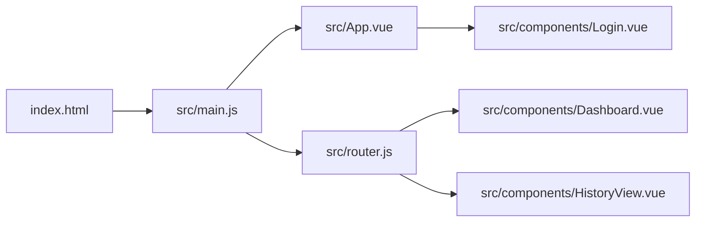
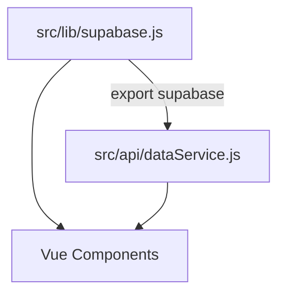
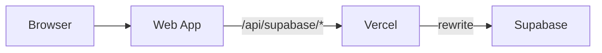

# 06｜依赖关系

## 1) JavaScript/前端依赖

依赖声明位于 [package.json](file:///workspace/package.json#L11-L33)。

### 运行时依赖（dependencies）

- `vue`：应用框架（组件、响应式、生命周期）
- `vue-router`：SPA 路由（见 [router.js](file:///workspace/src/router.js)）
- `element-plus`：UI 组件库（见 [main.js](file:///workspace/src/main.js#L3-L11)）
- `@element-plus/icons-vue`：图标（各组件内引用）
- `@supabase/supabase-js`：鉴权 + 表 CRUD（见 [supabase.js](file:///workspace/src/lib/supabase.js)）
- `@capacitor/core` / `@capacitor/android` / `@capacitor/ios` / `@capacitor/cli`：多端壳（目录 `android/`、`ios/`）
- `echarts`：图表库（当前仓库代码未检索到直接使用，可能为预留或历史遗留）
- `xlsx`：Excel 处理库（当前仓库代码未检索到直接使用，可能为预留或历史遗留）

### 开发依赖（devDependencies）

- `vite`：构建与 dev server（本仓库使用 `rolldown-vite` 变体，见 [package.json](file:///workspace/package.json#L29-L33)）
- `@vitejs/plugin-vue`：Vue SFC 支持（见 [vite.config.js](file:///workspace/vite.config.js)）
- `sass`：Sass 编译（如果项目后续引入 `.scss`）
- `postcss` / `autoprefixer`：CSS 处理
- `tailwindcss`：utility class（当前未见配置文件；但组件里大量使用 Tailwind 风格 class）

## 2) 内部模块依赖（代码级）

### 入口依赖链

### 数据访问依赖链

要点：

- 组件有两种数据访问方式并存：
  - 直接使用 `supabase.from(...)`（如 [Dashboard.vue](file:///workspace/src/components/Dashboard.vue#L240-L255)、[HistoryView.vue](file:///workspace/src/components/HistoryView.vue#L269-L285)）
  - 通过 `dataService` 封装调用（如库存、删除记录等）

## 3) Web 生产代理依赖

- 前端：生产 Web 环境把 Supabase baseUrl 切换为 `/api/supabase`（见 [supabase.js](file:///workspace/src/lib/supabase.js#L10-L13)）
- 平台：Vercel 通过 rewrite 转发（见 [vercel.json](file:///workspace/vercel.json#L1-L7)）

依赖关系：

## 4) 原生壳依赖（Android/iOS）

### Android（Gradle）

- 应用模块依赖声明：[android/app/build.gradle](file:///workspace/android/app/build.gradle#L33-L43)
  - `project(':capacitor-android')`
  - `project(':capacitor-cordova-android-plugins')`
  - AndroidX（appcompat/coordinatorlayout/splashscreen）

### iOS（Swift Package Manager）

- Capacitor SwiftPM 依赖：[Package.swift](file:///workspace/ios/App/CapApp-SPM/Package.swift#L4-L24)
  - `ionic-team/capacitor-swift-pm` `8.0.1`（exact）

